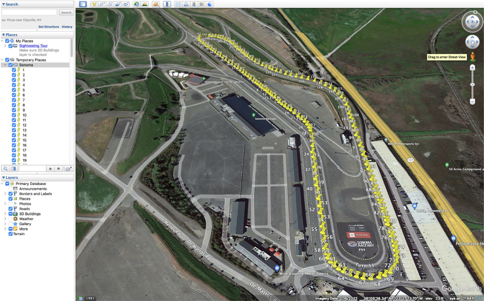
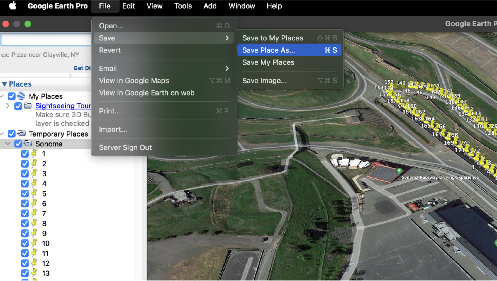
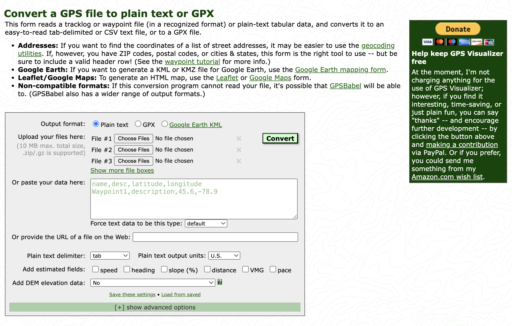
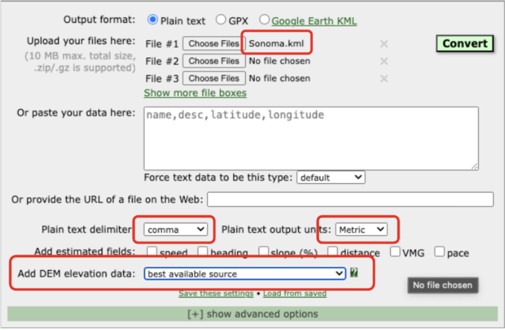
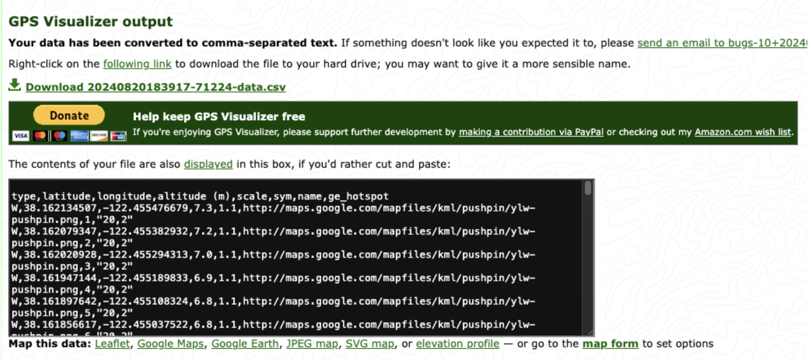

# AUTO 566 Modeling Analysis & Control of Hybrid Electric Vehciles Project
# $Supermileage$  $Cedar$  $Modeling$
## Authors 
### Vijay Balasekaran   vbalasek@umich.edu
### Savannah Belton     sbelton@umich.edu
### Austin Leiphart     leiphart@umich.edu
### Skylar Lennon       skylarl@umich.edu
### Ryan O'Malley       romalley@umich.edu

# Introduction
This AUTO 566 project involves generating models of varying levels of complexity to capture and predict the dynamic behavior of the next University of Michigan Supermileage vehilce, Cedar. These models will help to make critical architetural decisions about the vehicle as the team undergoes a holistic systems engineering design process with the effort to win the 2026 and 2027 Shell Eco Marathon (SEM) competition. 

This README will walk you through the entire project, allowing you to understand, tweak, and recreate models for similar future vehicles. While I encourage you to explore the repo in its entirety on your own, there is a natural progression one can take through the project which is described in depth thoughout this README, and summarized here:

1. Model the track
2. Generate a drive strategy
3. Model the vehicle dynamics
4. Model vehicle power/energy flow
    Battery -> Inverter --> Motor --> Transmission --> Road
5. Simulate & view results
6. Tweak one variable within steps 1-4. 
7. Repeat step 5.

One very important thing to note is that a reverse-modeling strategy is employed. In reverse modeling, the input is the desired vehicle behavior-what we'll refer to as the drive cycle-which defines a speed profile of the vehicle. The drive cycle also encapsulates the route (or racing line) the vehicle will drive, including turning and elevation changes. We have anticipated 3 potential courses for the '26 & '27 SEM including the streets of Detroit, the Indy Road Course, and the Sonoma Raceway, described below.

## TRACK MODELING
We cannot model our vehicle's performance if we do not know the terrain upon which it will be driving. So, we begin with modeling the 3 tracks at which we anticipate the '26 & '27 SEM may be held. 

1. **The Streets of Detroit**: This course will be modeled as a flat track with the start-finish line at Huntington Place and taking the following route through the streets of Detroit:

2. **The Indianapolis Motor Speedway Road course**: This is the track at which the '22, '23, '24, and '25 SEM has been held. While the location of the '26, & '27 SEM is unknown (as of 3-29-25), this course is the most likely candidate. As such, we will model the track including its minor elevation changes.

3. **The Sonoma Raceway**: We will regard the Sonoma Raceway as the 'worse-case scenario' track. Meaning, Sonoma's relative elevation change of 160 ft dwarfs that of the Indy Road Course and our flat model of the streets of Detroit. Consequentially, racing at Sonoma would yeild the highest power requirements for our system and will be the most difficult to design to.

All three of these tracks will be modeled with two levels of complexity, giving us 6 total track models. 

1. Flat Projection Models:
- Created from [linear_track_generator.m](/drive_cycle/track_modeling/linear_track_generator.m), these models will only accounts for the distance traveled __along the track__ and will NOT account for elevation changes throughout the course. Thus, when used in the final simulation, we will only modeling longitudinal vehicle dynamics (think ΔX only).

To generate these models, we will simply use the 'measure distance' function in google maps and trace a rough racing line along the center of the track to obtain both the lap length, and the distance to the location of the stop point according to the [SEM Rules](https://www.shellecomarathon.com/about/global-rules/_jcr_content/root/main/section/simple_copy_copy_143/link_list/links/item0.stream/1725262844182/58f0026a158591aab5df4789d7440c79c129c37d/shell-eco-marathon-2025-official-rules-chapter-i.pdf)
This information along with the number of laps can then be input to [linear_track_generator.m](/drive_cycle/track_modeling/linear_track_generator.m) to generate the flat projection model. The default elevation profile type for this program is 'flat', which is what we will be using for the AUTO 566 project. However, if you'd like to explore simulating tracks with constant elevation changes, there are instuctions within the program explaining how to do so. 

2. Elevated Projection Models 
- Created from [linearizeTrack.m](drive_cycle/track_modeling/linearizeTrack.m), these models will include both the distance along the track, and the courses' elevation changes (think ΔX & ΔZ). Thus, when used in the final simulation, we will still only be accounting for longitudinal vehicle dynamics, but we will also account for the varying road load as a function of the track's slope.

 For each track, a racing line will be automatically transcribed based on heuristics found in [this paper](TODO). We'll use the strategies described in the paper along with real GPS data for each track in order to generate the the model. The process of obtaining this GPS data is described below using the process of gaining GPS data for the Sonoma Raceway as an example:

1. [Download Google Earth Pro](https://www.google.com/earth/about/versions/#earth-pro)
2. Navigate to the track

3. Use the 'New Placemark' button to place points around the track

Make sure to put the placemarks at the center of the track and to place the first and last placemark at the location of the start-finish line
4. Export these points to a .kml file

5. Navigate to [GPSVisualizer](https://www.gpsvisualizer.com/convert_input)

6. Upload track .kml file, and configure output

7. Click 'Convert' and Download the zip file

8. Upzip and move to [drive_cycle/track_modeling/csv](drive_cycle/track_modeling/csv)
9. Rename file and match with name used in [linearizeTrack.m](drive_cycle/track_modeling/linearizeTrack.m)

## DRIVING STRATEGY
[TODO: BRIEF INTRO]

**All Driving Strategies:**
- Stop at required stop points for UCs
- Finish within the allotted time
- Don't exceed max parameters for whole powertrain

**Flat Track Drive Strategies:**
- All tracks considered without elevation chagnes
- Start here to optimize PnG (number of pulses, high and low values for pulse, etc)
- Should yeild theoretical max efficiency 

**Linearized Track Strategies:**
- Section off PnG & downhill coasting
- Optimize PnG with this consideration
- Transition between PnG & coast (transition at max speed? min speed?) [todo: cite that paper]

## VEHICLE MODELING
$Vehicle$ $Dynamics$ $Modeling$
- [TODO]

$Drive$ $Strategy$ $Modeling$
- [TODO]

$Battery$ $Modeling$
- [TODO]

$Inverter$ $Modeling$
- [TODO]

$Motor$ $Modeling$
- [TODO]

$Transmission$ $Modeling$
- [TODO]

## [TODO] REFERENCES
- MathWorks: For initial vehicle model which was modified for the purpose of this project. 
- University of Michigan Solar Car For their motor modeling code. 
- Papers we cite
- Explicit references (hyperlinks) to the documents which are cited.
- ME 565 battery model 

TODO
- Have the drive strat select the track
- have the track modeling generate the name of the track