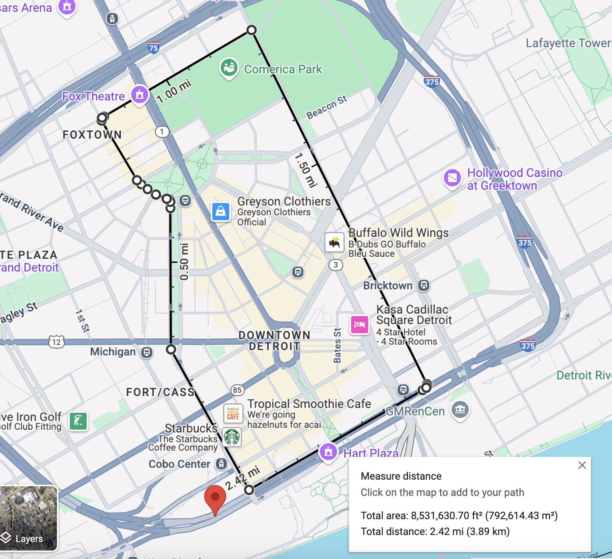
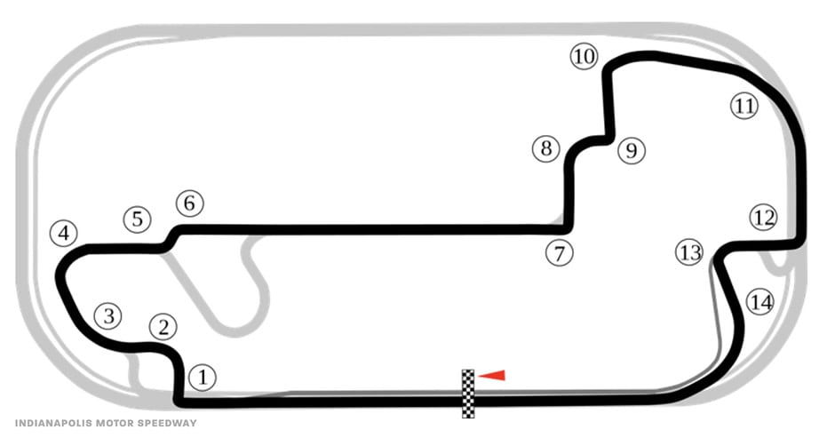
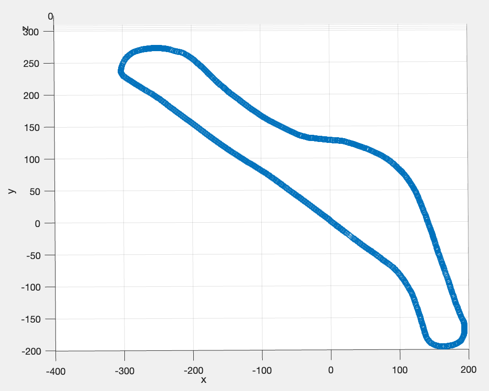
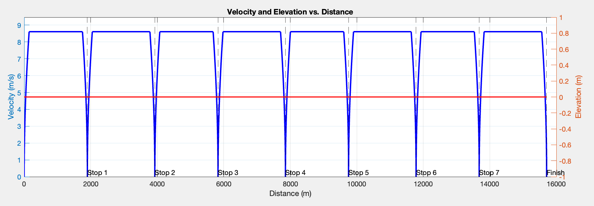
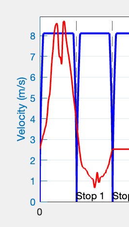

# AUTO 566 Modeling Analysis & Control of Hybrid Electric Vehciles Project
# $Supermileage$  $Cedar$  $Modeling$
## Authors 
### Vijay Balasekaran   vbalasek@umich.edu
### Savannah Belton     sbelton@umich.edu
### Austin Leiphard     leiphart@umich.edu
### Skylar Lennon       skylarl@umich.edu
### Ryan O'Malley       romalley@umich.edu

# Introduction
This AUTO 566 project involves generating models of varying levels of complexity to capture and predict the dynamic behavior of the next University of Michigan Supermileage vehilce, Cedar. These models will help to make critical architetural decisions about the vehicle as the team undergoes a holistic systems engineering design process with the effort to win the 2026 and 2027 Shell Eco Marathon (SEM) competition. 

This README will walk you through the entire project, allowing you to understand, tweak, and recreate models for similar future vehicles. While I encourage you to explore the repo in its entirety on your own, there is a natural progression one can take through the project which is described in depth thoughout this README, and summarized here:

1. Model the track
2. Generate a drive strategy
3. Model the vehicle dynamics
4. Model vehicle energy flow
    Battery -> Inverter --> Motor --> Transmission --> Road
5. Simulate & view results
6. Tweak one variable within steps 1-4. 
7. Repeat step 5.

One very important thing to note is that a reverse-modeling strategy is employed. In reverse modeling, the input is the desired vehicle behavior-what we'll refer to as the drive cycle-which defines a speed profile of the vehicle. The drive cycle also encapsulates route (or racing line) the vehicle will drive, including turning and elevation changes. We have anticipated 3 potential courses for the '26 & '27 SEM, the Detroit Streets, the Indy Road Course, and the Sonoma Raceway, described below.

## TRACK MODELING
We cannot model our vehicle's performance if we do not know the terrain upon which it will be driving. So, we begin with modeling the 3 tracks at which we anticipate the '26 & '27 SEM may be held. 

1. **The Streets of Detroit**: This course will be modeled as a flat track with the start-finish line at Huntington Place and taking the following route through the streets of Detroit:

2. **The Indianapolis Motor Speedway Road course**: This is the track at which the '22, '23, '24, and '25 SEM has been held. While the location of the '26, & '27 SEM unknown (as of 3-29-25) is the most likely candidate. As such, we will model the track including its minor elevation changes, and a manually chosen racing line derrived from heuristics found in [this paper](TODO).

3. **The Sonoma Raceway**: We will regard the Sonoma Raceway as the 'worse-case scenario' track. Meaning, Sonoma's relative elevation change of 160 ft dwarfs that of the Indy Road Course and our flat model of the streets of Detroit. Consequentially, racing at Sonoma would yeild the highest power requirements for our system and will be the most difficult to design to.

All three of these tracks will be modeled with three levels of complexity.

The basic models, created from [linear_track_generator.m](/drive_cycle/track_modeling/linear_track_generator.m) only accounts for the distance traveled __along the track__ and will NOT account for elevation changes throughout the course. Thus, when used in the final simulation, we will only modeling longitudinal vehicle dynamics (think ΔX only). It's important to note that the 'distance along the track' is not equivalent to the apparent distance you would see viewing the track from above but rather is the absolute euclidean distance. 

The intermediate models, created from [linearizeTrack.m](drive_cycle/track_modeling/linearizeTrack.m), will include both the distance along the track, and the courses' elevation changes (think ΔX & ΔZ). Thus, when used in the final simulation, we will still only be accounting for longitudinal vehicle dynamics, but we will also account for the varying road load as a function of the track's slope.

Our advanced track models will be 3D models, incorporating turns and elevation changes (think ΔX, ΔY, & ΔZ). Thus, when used in the final simulation, we will be accounting for both the longitudinal an lateral vehicle dynamics. More on this in the 'Vehicle Dynamics Modeling' Section.

## DRIVING STRATEGY
[TODO: BRIEF INTRO]

**All Driving Strategies:**
- Stop at required stop points for UCs
- Finish within the allotted time
- Don't exceed max parameters for whole powertrain

**Flat Track Drive Strategies:**
- Start here to optimize PnG
- Theoretical max efficiency 

**Linearized Track Strategies:**
- Section off PnG & downhill coasting
- 

**Non-Linear Track Stragegies**
- Section off PnG, downhill coasting, and turning
- Optimizes both speed and turns for max efficiency

## VEHICLE MODELING
$Vehicle$ $Dynamics$ $Modeling$
- [TODO]

$Drive$ $Strategy$ $Modeling$
- [TODO]

$Battery$ $Modeling$
- [TODO]

$Inverter$ $Modeling$
- [TODO]

$Motor$ $Modeling$
- [TODO]

$Transmission$ $Modeling$
- [TODO]

## [TODO] REFERENCES
- MathWorks: For initial vehicle model which was modified for the purpose of this project. 
- University of Michigan Solar Car For their motor modeling code. 
- Papers we cite
- Explicit references (hyperlinks) to the documents which are cited.
- ME 565 battery model 

